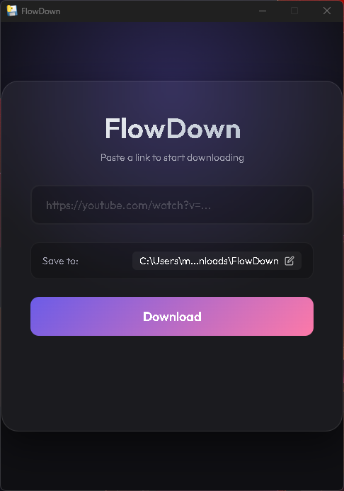

# FlowDown

**FlowDown** is a beautiful, modern, and cross-platform video downloader app. It allows you to download videos from YouTube, Twitter (X), and many other platforms with a simple paste of a link.



## Features
- 🎥 **Universal Support**: Downloads from YouTube, X (Twitter), and more.
- 🎨 **Modern UI**: Sleek, glassmorphism-inspired design.
- 📁 **Custom Locations**: Choose exactly where you want your videos saved.
- 🖥️ **Cross-Platform**: Runs on Windows, macOS, and Linux.

## Download
You can download the latest version for your operating system from the [Releases Page](../../releases).

- **Windows**: Download `FlowDown-Windows.exe`
- **Mac**: Download `FlowDown-MacOS.app` (inside the zip)
- **Linux**: Download `FlowDown-Linux`

## Development
To run this locally:

1. Clone the repo
2. Install dependencies:
   ```bash
   pip install -r requirements.txt
   ```
3. Run the app:
   ```bash
   python main.py
   ```

## Built With
- [Python](https://www.python.org/)
- [pywebview](https://pywebview.flowrl.com/)
- [yt-dlp](https://github.com/yt-dlp/yt-dlp)
